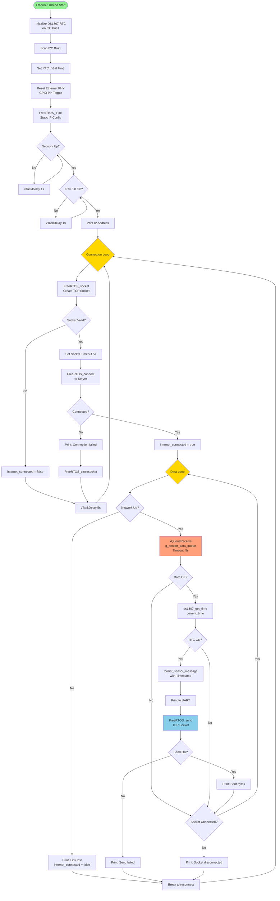
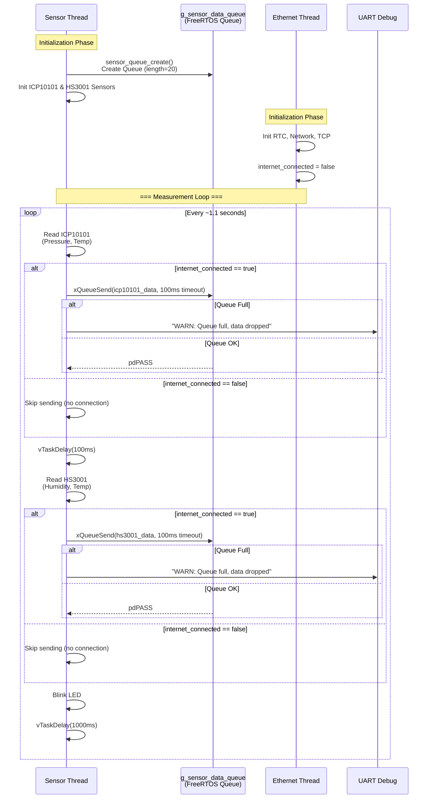
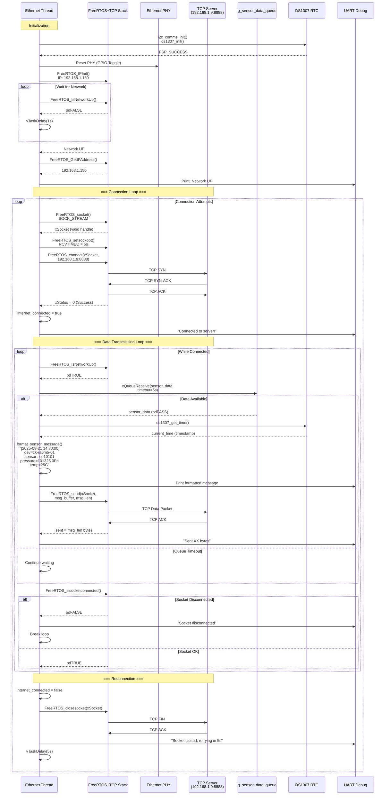

# Renesas RA CMake Project

This project is generated by RASC.

###  Building via CLI:
Configure: ```cmake -DARM_TOOLCHAIN_PATH="/your/toolchain/path" -DCMAKE_TOOLCHAIN_FILE=cmake/gcc.cmake  -G Ninja -B build/Debug```

- Ex.: ```cmake -DARM_TOOLCHAIN_PATH="C:/12_2_mpacbti_rel1/bin" -DCMAKE_TOOLCHAIN_FILE=cmake/gcc.cmake  -G Ninja -B build/Debug```
- Ex.: ```cmake -DARM_TOOLCHAIN_PATH="C:/12_2_mpacbti_rel1/bin" -DCMAKE_TOOLCHAIN_FILE=cmake/gcc.cmake  -DCMAKE_BUILD_TYPE=Release -G Ninja -B build/Release```

Build: ```cmake --build build/Debug```


### Configure via Visual Studio Code
- Set ARM_GCC_TOOLCHAIN_PATH as an environment variable before starting VS code or alternatively set ARM_TOOLCHAIN_PATH in .vscode/cmake-kits.json
- Select "ARM GCC kit with toolchainFile" kit in VS Code status bar
- It is recommended to avoid spaces in the toolchain and project paths as they might be interpreted as delimiters by CMake and the other build tools.

Example:

```set ARM_GCC_TOOLCHAIN_PATH=C:/12_2_mpacbti_rel1/bin```
```cd "C:/embedded/Renesas_Workspace/Test_Project" && code .```

- Click build in VS Code status bar

### Sensor Thread Flowchart

```mermaid
flowchart TD
    Start([Sensor Thread Start]) --> InitUART[Initialize UART]
    InitUART --> CreateQueue[Create Sensor Data Queue]
    CreateQueue --> InitI2C0[Initialize I2C Bus0]
    InitI2C0 --> ScanI2C0[Scan I2C Bus0]
    ScanI2C0 --> InitICP[Initialize ICP10101<br/>Pressure Sensor]
    InitICP --> ResetICP[Soft Reset ICP]
    ResetICP --> ReadID[Read Product ID]
    ReadID --> ReadOTP[Read OTP Calibration]
    ReadOTP --> InitHS[Initialize HS3001<br/>Humidity Sensor]
    InitHS --> LoopStart{Measurement Loop}
    
    LoopStart --> ReadICP[Read ICP10101<br/>Pressure & Temp]
    ReadICP --> ICPSuccess{Read OK?}
    ICPSuccess -->|Yes| PrepareICP[Prepare sensor_data<br/>icp10101]
    ICPSuccess -->|No| Delay1
    PrepareICP --> CheckInternet1{internet_connected?}
    CheckInternet1 -->|Yes| SendICP[xQueueSend ICP data]
    CheckInternet1 -->|No| Delay1
    SendICP --> QueueFull1{Queue Full?}
    QueueFull1 -->|Yes| WarnICP[UART: Queue full]
    QueueFull1 -->|No| Delay1
    WarnICP --> Delay1[vTaskDelay 100ms]
    
    Delay1 --> ReadHS[Read HS3001<br/>Humidity & Temp]
    ReadHS --> HSSuccess{Read OK?}
    HSSuccess -->|Yes| PrepareHS[Prepare sensor_data<br/>hs3001]
    HSSuccess -->|No| BlinkLED
    PrepareHS --> CheckInternet2{internet_connected?}
    CheckInternet2 -->|Yes| SendHS[xQueueSend HS data]
    CheckInternet2 -->|No| BlinkLED
    SendHS --> QueueFull2{Queue Full?}
    QueueFull2 -->|Yes| WarnHS[UART: Queue full]
    QueueFull2 -->|No| BlinkLED
    WarnHS --> BlinkLED[Blink LED]
    
    BlinkLED --> Delay2[vTaskDelay 1000ms]
    Delay2 --> LoopStart
    
    style Start fill:#90EE90
    style LoopStart fill:#FFD700
    style SendICP fill:#87CEEB
    style SendHS fill:#87CEEB
```


### Ethernet Thread Flowchart


### Sequence Diagram: Inter-Task Communication (Sensor Thread ↔ Ethernet Thread)

### Sequence Diagram: TCP Client Communication (Ethernet Thread ↔ TCP Server)
